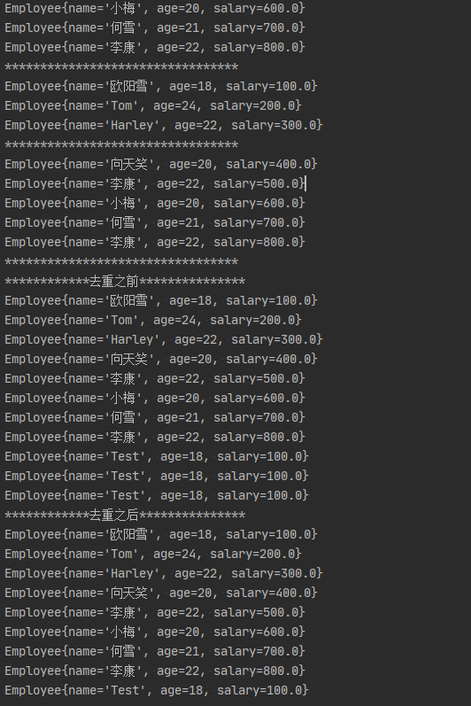

# Java8_Study
关于Java8新特性的学习

2014年3月发布

- 速度更快
  - 修改底层数据结构：如HashMap（数组-链表-红黑树），HashSet，ConcurrentHashMap（CAS算法）
  - 修改垃圾回收机制：取消堆中的永久区（PremGen）->回收条件苛刻，使用元空间（MetaSpace）->直接使用物理内存->加载类文件
- 代码更少（增加了新的语法Lambda表达式）
- 强大的Stream API
- 便于并行
- 最大化减少空指针异常 Optional容器类

# Lambda表达式

Lambda是一个匿名函数，可以把Lambda表达式理解为是一段可以传递的代码（将代码像数据一样进行传递）。可以写出更简洁、更灵活的代码。作为一种更紧凑的代码风格，使Java的语言表达能力得到了提升。

## 1、举例：

`(o1, o2) -> Integer.compare(o1, o2)`

## 2、格式：

| `->`     | 称为Lambda操作符 或 箭头操作符                     |
| -------- | -------------------------------------------------- |
| `->`左侧 | Lambda形参列表(其实就是接口中的抽象方法的形参列表) |
| `->`右侧 | Lambda体(其实就是重写的抽象方法的方法体)           |

## 3、Lambda表达式的使用：6种场合

### 3.1.语法格式一：

无参，无返回值

```java
Runnable r1 = new Runnable() {
    @Override
    public void run() {
        System.out.println("This is general ");
    }
};
r1.run();
System.out.println("语法格式一：无参，无返回值");
Runnable r2 = () -> System.out.println("This is lambda");
r2.run();
```

### 3.2.语法格式二：

有参，无返回值

```JAVA
Consumer<String> con = new Consumer<String>() {
    @Override
    public void accept(String s) {
        System.out.println(s);
    }
};
con.accept("Test");
System.out.println("语法格式二：有参，无返回值");
Consumer<String> con02 = (String s) -> System.out.println(s);
con02.accept("Test");
```

### 3.3.语法格式三：

数据类型可以省略，因为可以由编译器推断得出，称为“**类型推断**”

```java
        System.out.println("语法格式三：数据类型可以省略，因为可以由编译器推断得出，称为“类型推断”");
//        Consumer<String> con02 = (String s) -> System.out.println(s);
        Consumer<String> con02 = (s) -> System.out.println(s);
        con02.accept("Test");
```

### 3.4.语法格式四：

Lambda 若**只需要一个**参数时，参数的小括号可以省略

```java
        System.out.println("语法格式四：Lambda 若只需要一个参数时，参数的小括号可以省略");
//        Consumer<String> con02 = (s) -> System.out.println(s);
        Consumer<String> con02 = s -> System.out.println(s);
        con02.accept("Test");
```

### 3.5.语法格式五：

Lambda 需要**两个或者两个以上**的参数，多条执行语句，并且有返回值时

```java
Comparator<Integer> com1 = new Comparator<Integer>() {
    @Override
    public int compare(Integer o1, Integer o2) {
        System.out.println(o1);
        System.out.println(o2);
        return o1.compareTo(o2);
    }
};
System.out.println(com1.compare(12, 21));
System.out.println("语法格式五：Lambda 需要两个或者两个以上的参数，多条执行语句，并且有返回值时");
Comparator<Integer> com2 = (o1, o2) -> {
    System.out.println(o1);
    System.out.println(o2);
    return o1.compareTo(o2);
};
System.out.println(com2.compare(12, 21));
```

### 3.6.语法格式六：

当Lambda体只有一条语句时，return与大括号都可以省略

```java
Comparator<Integer> com1 = new Comparator<Integer>() {
    @Override
    public int compare(Integer o1, Integer o2) {
        return o1.compareTo(o2);
    }
};
System.out.println("语法格式六：当Lambda体只有一条语句时，return与大括号都可以省略");
Comparator<Integer> com2 = (o1, o2) -> o1.compareTo(o2);
```

## 4、Lambda本质：

作为接口（函数式接口）的实例

## [小结]：

|            |                                                              |
| ---------- | ------------------------------------------------------------ |
| `->`左侧： | Lambda形参列表的参数类型可以省略,当参数列表只有一个参数时，可以省略() |
| `->`右侧： | 当Lambda体只有一条执行语句（可能是return语句），可以省略{}和return关键字 |

## 5、函数式接口

Lambda表达式需要“函数式接口”的支持

### 5.1.定义

当一个接口**有且只有一个**抽象方法，则此接口称为“函数式接口”

### 5.2.Runnable接口例子

java源码中Runnable接口就是一个函数式接口，**有且只有一个**抽象方法。并且**函数式接口**都用`@FunctionalInterface`注解进行标注了，当一个接口打上`@FunctionalInterface`注解之后就声明为一个**函数式接口**，这个接口中就只能有一个抽象方法，大于一个抽象方法就会报错。

```java
@FunctionalInterface
public interface Runnable {
    /**
     * When an object implementing interface <code>Runnable</code> is used
     * to create a thread, starting the thread causes the object's
     * <code>run</code> method to be called in that separately executing
     * thread.
     * <p>
     * The general contract of the method <code>run</code> is that it may
     * take any action whatsoever.
     *
     * @see     java.lang.Thread#run()
     */
    public abstract void run();
}
```

> 注意
> 我们自己定义 函数式接口的时候，@Functionallnterface是可选的， 就算我不写这个注解，只要保证满足函数式接口定
> 义的条件，也照样是函数式接口。但是,建议加上该注解

### 5.3.自定义函数式接口

```java
@FunctionalInterface
public interface MyFun {
    public Integer getValue(Integer num);
}
```

```java
public class MyFunTest {
    @Test
    public void test() {
        Integer num = operation(100, (x) -> x * x);
        System.out.println(num);
        System.out.println(operation(200, (y) -> y + 200));
    }

    public Integer operation(Integer num, MyFun mf) {
        return mf.getValue(num);
    }
}
```

练习：调用Collections.sort()方法，通过定制排序比较两个Employee(先按年龄比，年龄相同按姓名比)，使用Lambda作为参数传递。

```java
    List<Employee> employees=Arrays.asList(
            new Employee("张三",18,9496.2),
            new Employee("李四",52,2396.2),
            new Employee("王五",56,996.2),
            new Employee("赵六",8,94.2)
    );

    @Test
    public void test1(){
         Collections.sort(employees, (e1,e2)->{
             if(e1.getAge()==e2.getAge()){
                 return e1.getName().compareTo(e2.getName());
             }else{
                 return Integer.compare(e1.getAge(), e2.getAge());
             }
         });

         for (Employee employee : employees) {
            System.out.println(employee);
        }
    }
```

### 5.4.Java核心内置的函数式接口

为了免去用户每次使用Lambda表达式时，都自行创建函数式接口，Java提供了4大核心内置 函数式接口

| 函数式接口                | 参数类型 | 返回类型 | 用途                                                         |
| ------------------------- | -------- | -------- | ------------------------------------------------------------ |
| `Consumer<T>`消费型接口   | T        | void     | 对类型为T的对象应用操作，包含方法：`void accept(T t)`        |
| `Supplier<T>`供给型接口   | 无       | T        | 返回类型为T的对象，包含方法：`T  get()`                      |
| `Function<T,R>`函数型接口 | T        | R        | 对类型为T的对象应用操作，并返回结果。结果是R类型的对象。包含方法：`R apply(T t)` |
| `Predicate<T>`断定型接口  | T        | boolean  | 确定类型为T的对象是否满足某约束，并返回boolean值。包含方法：`boolean test(T t)` |

> 对于常见的泛型模式，推荐的泛型类型变量：
>
> -  E - Element (在集合中使用，因为集合中存放的是元素)
> -  T - Type（Java 类）
> -  K - Key（键）
> -  V - Value（值）
> -  N - Number（数值类型）
> -  R - Result （返回结果，多用于函数式编程）
> - ？ - 表示不确定的java类型

转载自：https://www.cnblogs.com/wuyx/p/9000312.html


 其他补充接口：


### 5.5.函数式接口例子

#### **一、Consumer<T>：消费型接口（void accept(T t)）**

来看一个简单得例子：

```java
@Test
public void test_Consumer() {
    happyTime(100, new Consumer<Double>() {
        @Override
        public void accept(Double aDouble) {
            System.out.println("Money:" + aDouble);
        }
    });
    System.out.println("消费型接口 Consumer<T>");
    happyTime(100, money -> System.out.println("Money:" + money));
}

public void happyTime(double money, Consumer<Double> con) {
    con.accept(money);
}
```

以上为消费型接口，有参数，无返回值类型的接口。

#### **二、Supplier<T>：供给型接口（T get（））**

　　来看一个简单得例子：

```java
//Supplier<T> 供给型接口:
//需求：产生指定个数的整数，并放入集合中
@Test
public void test_Supplier() {
    List<Integer> numList01 = getNumList(10, new Supplier<Integer>() {
        @Override
        public Integer get() {
            return (int) (Math.random() * 100);
        }
    });
    System.out.println(numList01);
    System.out.println("供给型接口 Supplier<T>");
    List<Integer> numList02 = getNumList(10, () -> (int) (Math.random() * 100));
    System.out.println(numList02);
}

public List<Integer> getNumList(int num, Supplier<Integer> sup) {
    List<Integer> list = new ArrayList<>();
    for (int i = 0; i < num; i++) {
        Integer n = sup.get();
        list.add(n);
    }
    return list;
}
```

上面就是一个供给类型得接口，只有产出，没人输入，就是只有返回值，没有入参

#### **三、Function<T, R>：函数型接口（R apply（T t））**

　　下面看一个简单的例子：

```java
//Function<T,R> 函数型接口:
//需求：处理字符串
@Test
public void test3() {
    String newStr01 = strHandler("\t\t\t 啦啦啦德玛西亚  ", new Function<String, String>() {
        @Override
        public String apply(String s) {
            return s.trim();
        }
    });
    System.out.println(newStr01);
    System.out.println("函数型接口 Function<T,R>");
    String newStr = strHandler("\t\t\t 啦啦啦德玛西亚  ", (str) -> str.trim());
    System.out.println(newStr);

    String subStr = strHandler("无与伦比，为杰沉沦", (str) -> str.substring(5, 9));
    System.out.println(subStr);
}

public String strHandler(String str, Function<String, String> fun) {
    return fun.apply(str);
}
```

上面就是一个函数型接口，输入一个类型得参数，输出一个类型得参数，当然两种类型可以一致。

#### **四、Predicate<T>：断言型接口（boolean test（T t））**

　　下面看一个简单得例子：

```java
    @Test
    public void test_Predicate() {
        List<String> list = Arrays.asList("北京", "南京", "天津");
        ArrayList<String> filterString01 = filterString(list, new Predicate<String>() {
            @Override
            public boolean test(String s) {
                return s.contains("京");
            }
        });
        System.out.println(filterString01);
        System.out.println("断定型接口 Predicate<T>");
        ArrayList<String> filterString02 = filterString(list, s -> s.contains("京"));
        System.out.println(filterString02);
    }

    /**
     * 根据给定的规则，过滤集合中的字符串
     * 此规则由Predicate的方法决定
     *
     * @param list 待过滤字符串集合
     * @param pre  规则
     * @return 过滤后的字符串
     */
    public ArrayList<String> filterString(List<String> list, Predicate<String> pre) {
        ArrayList<String> filterList = new ArrayList<>();
        for (String s : list) {
            if (pre.test(s)) {
                filterList.add(s);
            }
        }
        return filterList;
    }
```

上面就是一个断言型接口，输入一个参数，输出一个boolean类型得返回值。

# 方法引用

在学习lambda表达式之后，我们通常使用lambda表达式来创建匿名方法。然而，有时候我们仅仅是调用了一个已存在的方法。如下：

```java
Arrays.sort(stringsArray,(s1,s2)->s1.compareToIgnoreCase(s2));
```

 在Java8中，我们可以直接通过方法引用来**简写**lambda表达式中已经存在的方法。

```java
Arrays.sort(stringsArray, String::compareToIgnoreCase);
```

这种特性就叫做方法引用(Method Reference)。 

**方法引用**是用来直接访问**类**或者**实例**的**已经存在的方法或者构造方法**。方法引用提供了一种引用而不执行方法的方式，它需要由兼容的函数式接口构成的目标类型上下文。计算时，方法引用会创建函数式接口的一个实例。


- 当要传递给Lambda体的操作，已经有实现的方法时，可以使用方法引用。

- 方法引用可以看做是Lambda表达式深层次的表达。换句话说，方法引用就是Lambda表达式，也就是函数式接口的一个实例，通过方法的名字来指向一个方法，可以认为是Lambda表达式的一个语法糖。

  > 语法糖（Syntactic sugar），也译为糖衣语法，是由英国计算机科学家彼得·约翰·兰达（Peter J. Landin）发明的一个术语，指计算机语言中添加的某种语法，这种语法对语言的功能并没有影响，但是更方便程序员使用。通常来说使用语法糖能够增加程序的可读性，从而减少程序代码出错的机会。

- **要求**：实现接口的抽象方法的**参数列表**和**返回值类型**，必须与方法引用的方法参数列表和返回值类型保持一致。
- 格式：使用操作符`::`将类（或对象）与方法名分隔开来。

## 1、方法引用的使用场景

当要传递给Lambda体的操作，已经有实现的方法时，可以使用方法引用。

```java
@Test
public void test01() {
    // 方法引用
    Consumer<String> consumer02 = System.out::println;
    consumer02.accept("Test");
}
```

## 2、方法引用的分类

| 类型                             | 语法                            | 对应的Lambda表达式                        |
| -------------------------------- | ------------------------------- | ----------------------------------------- |
| 静态方法引用                     | ClassName :: staticMethodName   | (args) -> ClassName.staticMethod(args)    |
| 某个对象的实例方法引用           | object :: instanceMethodName    | (args) -> inst.instMethod(args)           |
| 某个类型的任意对象的实例方法引用 | ClassName :: instanceMethodName | (inst,args) -> ClassName.instMethod(args) |
| 构建方法引用                     | ClassName :: new                | (args) -> new ClassName1(args)            |

## 3、方法引用举例

### 3.1 对象 :: 非静态方法

 特定对象的实例方法引用的语法格式为： `object :: instanceMethodName` ，如
System.out::println 等价于lambda表达式 s -> System.out.println(s) 

代码示例：

```java
/**
 * 情况一：
 * 对象 :: 非静态方法
 * Consumer中的 void accept(T t)
 * PrintStream中的 public void println(String x) 
 */
@Test
public void test01() {
    // Lambda表达式
    Consumer<String> consumer01 = str -> System.out.println(str);
    consumer01.accept("Test");
    // 方法引用
    Consumer<String> consumer02 = System.out::println;
    consumer02.accept("Test");
}
```

```java
/**
 * Supplier 中的 T get()
 * Employee 中的 public String getName()
 */
@Test
public void test02() {
    Employee emp = new Employee("Tom", 12, 1000);
    // Lambda表达式
    Supplier<String> supplier01 = () -> emp.getName();
    System.out.println(supplier01.get());
    // 方法引用
    Supplier<String> supplier02= emp::getName;
    System.out.println(supplier02.get());
}
```

### 3.2 类 :: 静态方法

**静态方法引用**,**组成语法格式：**`ClassName :: staticMethodName`

代码示例：

```java
/**
 * 情况二：
 * 类 :: 静态方法
 * Comparator 中的 int compare(T o1, T o2)
 * Integer 中的 public static int compare(int x, int y)
 */
@Test
public void test03() {
    // Lambda表达式
    Comparator<Integer> comparator01 = (o1, o2) -> Integer.compare(o1, o2);
    System.out.println(comparator01.compare(12, 21));
    // 方法引用
    Comparator<Integer> comparator02 = Integer::compareTo;
    System.out.println(comparator02.compare(12, 21));
}
```

```java
/**
 * Function 中的 R apply(T t)
 * Math 中的 public static long round(double a)
 */
@Test
public void test04() {
    // Lambda表达式
    Function<Double, Long> function01 = d -> Math.round(d);
    System.out.println(function01.apply(12.3));
    // 方法引用
    Function<Double, Long> function02 =Math::round;
    System.out.println(function02.appl(12.3));
}
```

### 3.3 类 :: 非静态方法

代码示例：

```java
/**
 * 情况三：
 * 类 :: 非静态方法
 * Comparator 中的 int compare(T o1, T o2)
 * String 中的 public int compareTo(String anotherString)
 */
@Test
public void test05() {
    // Lambda表达式
    Comparator<String> comparator01 = (s1, s2) -> s1.compareTo(s2);
    System.out.println(comparator01.compare("abc", "abd"));
    // 方法引用
    Comparator<String> comparator02 = String::compareTo;
    System.out.println(comparator02.compare("abc", "abd"));
}
```

### 3.4 构造器引用

和方法引用类似，**函数式接口的抽象方法的形参列表跟构造器的形参列表一致**。
抽象方法的返回值类即为构造器所属的类的类型

代码示例：

```java
/**
 * 构造器引用
 * Supplier 中的 T get()
 * Employee 中的 public Employee()
 */
@Test
public void test01() {
    // Lambda表达式
    Supplier<Employee> sup01 = () -> new Employee();
    sup01.get();
    // 方法引用
    Supplier<Employee> sup02 = Employee::new;
    sup02.get();
}
```

```java
/**
 * 构造器引用
 * Function 中的 R apply(T t);
 * Employee 中的 public Employee(String name)
 */
@Test
public void test02() {
    // Lambda表达式
    Function<String, Employee> sup01 = (s) -> new Employee(s);
    System.out.println(sup01.apply("Tom"));
    // 方法引用
    Function<String, Employee> sup02 = Employee::new;
    System.out.println(sup01.apply("Tom"));
}
```

```java
/**
 * 构造器引用
 * BiFunction 中的 R apply(T t, U u);
 * Employee 中的 public Employee(String name, int age)
 */
@Test
public void test03() {
    // Lambda表达式
    BiFunction<String, Integer, Employee> biFunction01 = (name, age) -> new Employee(name, age);
    System.out.println(biFunction01.apply("Tom", 18));
    // 方法引用
    BiFunction<String, Integer, Employee> biFunction02 = Employee::new;
    System.out.println(biFunction02.apply("Tom", 18));
}
```

### 3.5 数组引用

```java
/**
 * 数组引用
 * Function 中的 R apply(T t);
 */
@Test
public void test04() {
    // Lambda表达式
    Function<Integer, String[]> function01 = (length) -> new String[length];
    System.out.println(function01.apply(10).length);
    // 方法引用
    Function<Integer, String[]> function02 = String[]::new;
    System.out.println(function02.apply(10).length);
}
```

# Stream API

Java8的两个重大改变，一个是**Lambda表达式**，另一个就是**Stream API**（**java.util.stream**）。
Stream 是Java8中**处理集合的关键抽象概念**，它可以对**集合**进行非常复杂的**查找**、**过滤**、**筛选**等操作。使用**Stream API**对集合数据操作，就类似于使用SQL执行的数据库查询。也可以使用**Stream API**来**并行**执行操作。

## 1、概述

### 1 .1 为什么需要Stream

> Stream是Java8的一大亮点，是对容器对象功能的增强，它专注于对容器对象进行各种非常便利、高效的 **聚合操作（aggregate operation）**或者大批量数据操作。Stream API借助于同样新出现的Lambda表达式，极大的提高编程效率和程序可读性。同时，它提供串行和并行两种模式进行汇聚操作，并发模式能够充分利用多核处理器的优势，使用fork/join并行方式来拆分任务和加速处理过程。所以说，Java8中首次出现的 **java.util.stream是一个函数式语言+多核时代综合影响的产物。**

### 1.2 什么是聚合操作

在传统的J2EE应用中，Java代码经常不得不依赖于关系型数据库的聚合操作来完成诸如：

- 客户每月平均消费金额
- 最昂贵的在售商品
- 本周完成的有效订单（排除了无效的）
- 取十个数据样本作为首页推荐

这类的操作。但在当今这个数据大爆炸的时代，在数据来源多样化、数据海量化的今天，很多时候不得不脱离 RDBMS，或者以底层返回的数据为基础进行更上层的数据统计。而Java的集合API中，仅仅有极少量的辅助型方法，更多的时候是程序员需要用Iterator来遍历集合，完成相关的聚合应用逻辑，这是一种远不够高效、笨拙的方法。

在Java7中，如果要找到年龄大于18岁的人并输出，我们需要这样写：

```java
/*Java 7 的取值实现*/
List<Employee> groceryTransactions = new ArrayList<>();
for(Employee e: employeeList){
    if(e.getAge() >18){
        groceryTransactions.add(e);
    }
}
for(Employee employee: groceryTransactions){
    System.out.println(employee);
}
```

而在 Java 8 使用 Stream，代码更加简洁易读；而且使用并发模式，程序执行速度更快。

```java
employeeList.stream().filter(employee -> employee.getAge() > 18).forEach(System.out::println);
```

Stream和Collections集合的区别：

- Collections是一种静态的内存数据结构，主要面向内存，存储在内存中
- Stream是有关计算的，主要面向CPU，通过CPU实现计算

注意：

- Stream自己不会存储元素
- Stream不会改变源对象，相反会返回一个持有结果的新Stream
- Stream操作是延迟执行的，这意味着会等到需要结果的时候才执行

### 1.3 Stream的操作三步骤

1. 创建Stream
   一个数据源（如：集合、数组），获取一个流
2. 中间操作
   一个中间操作链，对数据源的数据进行处理
3. 终止操作（终端操作）
   一个终止操作，执行中间操作链，并产生结果

代码示例：

```java
@Test
public void test01() {
    List<Employee> employeeList = new ArrayList<>();
    employeeList.add(new Employee("欧阳雪", 18, 100));
    employeeList.add(new Employee("Tom", 24, 200));
    employeeList.add(new Employee("Harley", 22, 300));
    employeeList.add(new Employee("向天笑", 20, 400));
    employeeList.add(new Employee("李康", 22, 500));
    employeeList.add(new Employee("小梅", 20, 600));
    employeeList.add(new Employee("何雪", 21, 700));
    employeeList.add(new Employee("李康", 22, 800));
    // 1）找到年龄大于18岁的人并输出；
    employeeList.stream().filter(employee -> employee.getAge() > 18).forEach(System.out::println);
    System.out.println("-------------------------------------------");
    // 2）找出所有薪资大于500的数量
    long count = employeeList.stream().filter(employee -> employee.getSalary() > 500).count();
    System.out.println(count);
}
```

在这个例子中

1. `employeeList.stream()`是创建流
2. `filter()`属于中间操作
3. `forEach()`、`count()`是终止操作

## 2、创建Stream

创建Stream（实例化）常用的四种方式

### 2 .1 通过集合 Collection

```java
// 创建方式一：通过集合 Collection
@Test
public void test01() {
    List<Employee> employees = EmployeeData.getEmployees();
    // default Stream<E> stream():返回一个顺序流
    Stream<Employee> employeeStream = employees.stream();
    // default Stream<E> parallelStream():返回一个并行流
    Stream<Employee> employeeParallelStream = employees.parallelStream();
}
```

### 2 .2 通过数组 Arrays

```java
// 创建方式二：通过数组
@Test
public void test02() {
    int[] arr = new int[]{1, 2, 3, 4, 5, 6};
    // 调用Arrays类的static <T> Stream<T> stream(T[] array)：返回一个流
    IntStream intStream = Arrays.stream(arr);
    Employee e1 = new Employee("Tom", 18, 200);
    Employee e2 = new Employee("Jack", 23, 400);
    Employee[] employees = new Employee[]{e1, e2};
    Stream<Employee> employeeStream = Arrays.stream(employees);
}
```

### 2 .3 通过 Stream

```java
// 创建方式三：通过Stream的static<T> Stream<T> of(T... values)
@Test
public void test03() {
    Stream<Integer> integerStream = Stream.of(1, 2, 3, 4, 5, 6, 7);
}
```

### 2 .4 创建无限流

```java
// 创建方式四：创建无限流
@Test
public void test04() {
    // 迭代
    // public static<T> Stream<T> iterate(final T seed, final UnaryOperator<T> f)
    // 遍历前10个偶数
    Stream.iterate(0, t -> t + 2)
            .limit(10)
            .forEach(System.out::println);
    // 生成
    // public static<T> Stream<T> generate(Supplier<T> s)
    Stream.generate(Math::random)
            .limit(10)
            .forEach(System.out::println);
}
```

## 3、Stream 的中间操作

多个**中间操作**可以连接起来形成一个**流水线**，除非流水线上触发终止操作，否则**中间操作不会执行任何的处理**！**而在终止操作时一次性处理，成为“惰性求值”。**

### 3.1 筛选与切片

| 方法                  | 描述                                                         |
| --------------------- | ------------------------------------------------------------ |
| `filter(Predicate p)` | 接受Lambda，从流中排除（筛选）某些元素                       |
| `distinct()`          | 通过流所生成元素的`hashCode()`和`equals()`,去除重复元素      |
| `limit(long maxSize)` | 截断流，使其元素不超过给定的数量（maxSize）                  |
| `skip(long n)`        | 跳过元素，返回一个扔掉了前n个元素的流。若流中元素不足n个，则返回一个空流，与`limit(n)`互补 |

测试数据：

```java
List<Employee> employeeList = new ArrayList<>();
        employeeList.add(new Employee("欧阳雪", 18, 100));
        employeeList.add(new Employee("Tom", 24, 200));
        employeeList.add(new Employee("Harley", 22, 300));
        employeeList.add(new Employee("向天笑", 20, 400));
        employeeList.add(new Employee("李康", 22, 500));
        employeeList.add(new Employee("小梅", 20, 600));
        employeeList.add(new Employee("何雪", 21, 700));
        employeeList.add(new Employee("李康", 22, 800));
```

代码示例：

```java
/**
 * 筛选与切片
 */
@Test
public void test01() {
    List<Employee> employeeList = EmployeeData.getEmployees();
    // filter(Predicate p)  接受Lambda，从流中排除（筛选）某些元素
    // 工资大于500
    employeeList.stream()
            .filter(employee -> employee.getSalary() > 500)
            .forEach(System.out::println);
    System.out.println("*********************************");
    // limit(long maxSize)  截断流，使其元素不超过给定的数量（maxSize）
    employeeList.stream()
            .limit(3)
            .forEach(System.out::println);
    System.out.println("*********************************");
    // skip(long n) 跳过元素，返回一个扔掉了前n个元素的流。若流中元素不足n个，则返回一个空流，与limit(n)互补
    employeeList.stream()
            .skip(3)
            .forEach(System.out::println);
    System.out.println("*********************************");
    // distinct() 通过流所生成元素的hashCode()和equals(),去除重复元素
    Employee employee = new Employee("Test", 18, 100);
    employeeList.add(employee);
    employeeList.add(employee);
    employeeList.add(employee);
    System.out.println("************去重之前***************");
    employeeList.stream().forEach(System.out::println);
    System.out.println("************去重之后***************");
    employeeList.stream().distinct().forEach(System.out::println);
}
```

运行结果：



### 3 .2 映射

| 方法                              | 描述                                                         |
| --------------------------------- | ------------------------------------------------------------ |
| `map(Function f)`                 | 接收一个函数作为参数，该函数会被应用到每个元素上，并将其映射成一个新的元素 |
| `mapTodouble(ToDoubleFunction f)` | 接收一个函数作为参数，该函数会被应用到每个元素上，产生一个新的DoubleStream |
| `mapToInt(ToIntFunction f)`       | 接收一个函数作为参数，该函数会被应用到每个元素上，产生一个新的IntStream |
| `mapToLong(ToLongFunction f)`     | 接收一个函数作为参数，该函数会被应用到每个元素上，产生一个新的LongStream |
| `flatMap(Function f)`             | 接收一个函数作为参数，将流中的每个值都换成另一个流，然后把所有流连接成一个流 |

`map(Function f)`代码示例：

```java
 // map(Function f)
 /* 接收一个函数作为参数，该函数会被应用到每个元素上，并将其映射成一个新的元素*/
 List<String> list = Arrays.asList("aa", "bb", "cc", "dd");
 System.out.println("Lambda 表达式：");
 list.stream().map(s -> s.toUpperCase()).forEach(System.out::println);
 System.out.println("方法引用：");
 list.stream().map(String::toUpperCase).forEach(System.out::println);
 System.out.println("*********************************");
 // 练习：获取员工姓名长度大于3的员工姓名
 List<Employee> employees = EmployeeData.getEmployees();
 employees.stream() // Stream<Employee>
         .map(Employee::getName) // Stream<String>
         .filter(name -> name.length() > 3)
         .forEach(System.out::println);
```

`flatMap(Function f)`代码示例：

```java
// flatMap(Function f)
/*接收一个函数作为参数，将流中的每个值都换成另一个流，然后把所有流连接成一个流*/
System.out.println("*********************************");
System.out.println("遍历List map写法");
list.stream().map(StreamTest02::fromStringToStream)
        .forEach(s-> s.forEach(System.out::println));
System.out.println("*********************************");
System.out.println("遍历List flatMap写法");
list.stream().flatMap(StreamTest02::fromStringToStream)
        .forEach(System.out::println);
```

### 3 .3 排序

| 方法                      | 描述                               |
| ------------------------- | ---------------------------------- |
| `sorted()`                | 产生一个新流，其中按自然顺序排序   |
| `sorted(Comparator comp)` | 产生一个新流，其中按比较器顺序排序 |

代码示例：

```java
/**
 * 排序
 */
@Test
public void test03() {
    // sorted()	产生一个新流，其中按自然顺序排序
    List<String> list = Arrays.asList("ccc", "bbb", "aaa");
    list.stream().sorted().forEach(System.out::println);
    System.out.println("*********************************");
    // sorted(Comparator comp)	产生一个新流，其中按比较器顺序排序
    List<Employee> employees = EmployeeData.getEmployees();
    employees.stream().sorted((e1, e2) -> {
        if (e1.getAge() == e2.getAge()) {
            return e1.getName().compareTo(e2.getName());
        } else {
            return Integer.compare(e1.getAge(), e2.getAge());
        }
    }).forEach(System.out::println);
}
```


## 4、Stream 的终止操作

### 4.1 匹配与查找

| 方法                     | 描述                                                         |
| ------------------------ | ------------------------------------------------------------ |
| `allMatch(Predicate p)`  | 检查是否匹配所有元素                                         |
| `anyMatch(Predicate p)`  | 检查是否至少匹配一个元素                                     |
| `noneMatch(Predicate p)` | 检查是否没有匹配元素                                         |
| `findFirst()`            | 返回第一个元素                                               |
| `findAny()`              | 返回当前流中的任意元素                                       |
| `count()`                | 返回流中元素的总数                                           |
| `max(Comparator c)`      | 返回流中最大值                                               |
| `min(Comparator c)`      | 返回流中最小值                                               |
| `forEach(Consumer c)`    | 内部迭代（使用Collection接口需要用户去做迭代，称为外部迭代。相反，Stream API使用内部迭代） |

代码示例：

```java
/**
 * 匹配与查找
 */
@Test
public void test01() {
    List<Employee> employees = Arrays.asList(
            new Employee("张三", 18, 9999.99, Employee.Status.FREE),
            new Employee("李四", 58, 5555.55, Employee.Status.BUSY),
            new Employee("王五", 26, 3333.33, Employee.Status.VOCATION),
            new Employee("赵六", 36, 6666.66, Employee.Status.FREE),
            new Employee("田七", 12, 8888.88, Employee.Status.BUSY)
    );
    // allMatch-检查是否匹配所有元素
    boolean allMatch = employees
            .stream()
            .allMatch(employee -> employee.getStatus().equals(Employee.Status.BUSY));
    System.out.println(allMatch);
    System.out.println("*********************************");
    // anyMatch-检查是否至少匹配一个元素
    boolean anyMatch = employees
            .stream()
            .anyMatch(employee -> employee.getStatus().equals(Employee.Status.BUSY));
    System.out.println(anyMatch);
    System.out.println("*********************************");
    // noneMatch-检查是否没有匹配所有元素
    boolean noneMatch = employees
            .stream()
            .noneMatch(employee -> employee.getStatus().equals(Employee.Status.BUSY));
    System.out.println(noneMatch);
    System.out.println("*********************************");
    // findFirst-返回第一个元素
    // Optional是Java8中避免空指针异常的容器类
    Optional<Employee> first = employees
            .stream()
            .sorted(Comparator.comparingDouble(Employee::getSalary))
            .findFirst();
    System.out.println(first.get());
    System.out.println("*********************************");
    // count() 返回流中元素的总数
    long count = employees.stream().filter(employee -> employee.getSalary() > 5000).count();
    System.out.println(count);
    System.out.println("*********************************");
    // max(Comparator c) 返回流中最大值
    System.out.println("返回最高的工资：");
    Optional<Double> max = employees.stream().map(Employee::getSalary)
            .max(Double::compareTo);
    System.out.println(max);
    System.out.println("*********************************");
    // min(Comparator c) 返回流中最小值
    System.out.println("返回工资最低的员工");
    Optional<Employee> min = employees.stream().min(Comparator.comparingDouble(Employee::getSalary));
    System.out.println(min);
    System.out.println("*********************************");
}
```


### 4.2 归约

| 方法                              | 描述                                                    |
| --------------------------------- | ------------------------------------------------------- |
| `reduce(T iden,BinaryOperator b)` | 可以将流中元素反复结合起来，得到一个值。返回T           |
| `reduce(BinaryOperator b)`        | 可以将流中元素反复结合起来，得到一个值。返回Optional<T> |

代码示例：

```java
/**
 * 归约
 */
@Test
public void test02() {
    // reduce(T iden,BinaryOperator b) 可以将流中元素反复结合起来，得到一个值。返回T
    // 练习1：计算1-10的自然数之和
    List<Integer> list = Arrays.asList(1, 2, 3, 4, 5, 6, 7, 8, 9, 10);
    Integer reduce01 = list.stream().reduce(0, Integer::sum);
    System.out.println(reduce01);
    System.out.println("*********************************");
    // reduce(BinaryOperator b) 可以将流中元素反复结合起来，得到一个值。返回Optional
    // 练习2：计算公司所有员工工资的总和
    List<Employee> employees = Arrays.asList(
            new Employee("张三", 18, 9999.99),
            new Employee("李四", 58, 5555.55),
            new Employee("王五", 26, 3333.33),
            new Employee("赵六", 36, 6666.66),
            new Employee("田七", 12, 8888.88)
    );
    Optional<Double> reduce02 = employees.stream().map(Employee::getSalary).reduce(Double::sum);
    System.out.println(reduce02);
    System.out.println("*********************************");
}
```


### 4.3 收集

| 方法                   | 描述                                                         |
| ---------------------- | ------------------------------------------------------------ |
| `collect(Collector c)` | 将流转换为其他形式。接收一个Collector接口的实现，用于给Stream中元素做汇总的方法 |

Collector 接口中方法的实现决定了如何对流执行收集的操作（如收集到List，Set，Map）。

另外，Collectors实用类提供了很多静态方法，可以便捷地创建常见收集器实例

代码示例：

```java
/**
 * 收集
 */
@Test
public void test03() {
    // collect(Collector c) 将流转换为其他形式。接收一个Collector接口的实现，用于给Stream中元素做汇总的方法
    // 练习1：查找工资大于6000的员工，结果返回为一个List或Set
    List<Employee> employees = Arrays.asList(
            new Employee("张三", 18, 9999.99),
            new Employee("李四", 58, 5555.55),
            new Employee("王五", 26, 3333.33),
            new Employee("赵六", 36, 6666.66),
            new Employee("田七", 12, 8888.88)
    );
    System.out.println("**********List**********");
    List<Employee> employeeList = employees.stream()
            .filter(employee -> employee.getSalary() > 6000)
            .collect(Collectors.toList());
    employeeList.forEach(System.out::println);
    System.out.println("**********Set**********");
    Set<Employee> employeeSet = employeeList.stream()
            .filter(employee -> employee.getSalary() > 6000)
            .collect(Collectors.toSet());
    employeeSet.forEach(System.out::println);
}
```

# Optional类

Optional< T>类(**java.util.Optional**) 是一个容器类，代表一个值存在或不存在。
原来用null表示一个值不存在，现在 Optional可以更好的表达这个概念。并且可以避免空指针异常。

常用方法：

> Optional.of(T t) : 创建一个 Optional 实例
> Optional.empty() : 创建一个空的 Optional 实例
> Optional.ofNullable(T t):若 t 不为 null,创建 Optional 实例,否则创建空实例
> isPresent() : 判断是否包含值
> orElse(T t) : 如果调用对象包含值，返回该值，否则返回t
> orElseGet(Supplier s) :如果调用对象包含值，返回该值，否则返回 s 获取的值
> map(Function f): 如果有值对其处理，并返回处理后的Optional，否则返回 Optional.empty()
> flatMap(Function mapper):与 map 类似，要求返回值必须是Optional

代码示例：

```java
package day04;

import org.junit.Test;

import java.util.Optional;

public class OptionalTest {

    @Test
    public void test01() {
        // Optional.of(T t) : 创建一个 Optional 实例
        Girl girl = new Girl();
        Optional<Girl> optionalGirl = Optional.of(girl);
        System.out.println(optionalGirl);
    }

    @Test
    public void test02() {
        // Optional.ofNullable(T t):若 t 不为 null,创建 Optional 实例,否则创建空实例
        Girl girl = null;
        Optional<Girl> optionalGirl = Optional.ofNullable(girl);
        System.out.println(optionalGirl);
    }

    @Test
    public void test03() {
        // 当Boy为null时
        Boy boy = null;
        String girlName_java7 = getGirlName_Java7(boy);
        System.out.println(girlName_java7);
        String girlName_java8 = getGirlName_Java8(boy);
        System.out.println(girlName_java8);
        // 当Girl为null时
        boy = new Boy(null);
        girlName_java8 = getGirlName_Java8(boy);
        System.out.println(girlName_java8);
    }

    // 空指针问题
    public String getGirlName(Boy boy) {
        return boy.getGirl().getName();
    }

    // java7 优化解决空指针问题
    public String getGirlName_Java7(Boy boy) {
        if (boy != null) {
            Girl girl = boy.getGirl();
            if (girl != null) {
                return girl.getName();
            }
            return null;
        }
        return null;
    }

    // java8 使用Optional类解决空指针问题
    public String getGirlName_Java8(Boy boy) {
        Optional<Boy> boyOptional = Optional.ofNullable(boy);
        Boy boy1 = boyOptional.orElse(new Boy(new Girl("Lucy")));
        Girl girl = boy1.getGirl();
        Optional<Girl> girlOptional = Optional.ofNullable(girl);
        Girl girl1 = girlOptional.orElse(new Girl("Ann"));
        return girl1.getName();
    }

}
```

