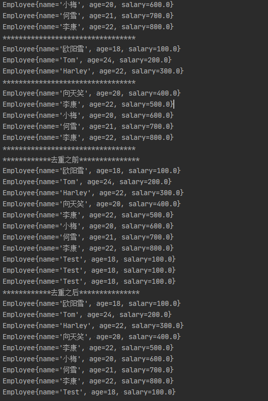

# Stream API

Java8的两个重大改变，一个是**Lambda表达式**，另一个就是**Stream API**（**java.util.stream**）。
Stream 是Java8中**处理集合的关键抽象概念**，它可以对**集合**进行非常复杂的**查找**、**过滤**、**筛选**等操作。使用**Stream API**对集合数据操作，就类似于使用SQL执行的数据库查询。也可以使用**Stream API**来**并行**执行操作。

## 1、概述

### 1 .1 为什么需要Stream

> Stream是Java8的一大亮点，是对容器对象功能的增强，它专注于对容器对象进行各种非常便利、高效的 **聚合操作（aggregate operation）**或者大批量数据操作。Stream API借助于同样新出现的Lambda表达式，极大的提高编程效率和程序可读性。同时，它提供串行和并行两种模式进行汇聚操作，并发模式能够充分利用多核处理器的优势，使用fork/join并行方式来拆分任务和加速处理过程。所以说，Java8中首次出现的 **java.util.stream是一个函数式语言+多核时代综合影响的产物。**

### 1.2 什么是聚合操作

在传统的J2EE应用中，Java代码经常不得不依赖于关系型数据库的聚合操作来完成诸如：

- 客户每月平均消费金额
- 最昂贵的在售商品
- 本周完成的有效订单（排除了无效的）
- 取十个数据样本作为首页推荐

这类的操作。但在当今这个数据大爆炸的时代，在数据来源多样化、数据海量化的今天，很多时候不得不脱离 RDBMS，或者以底层返回的数据为基础进行更上层的数据统计。而Java的集合API中，仅仅有极少量的辅助型方法，更多的时候是程序员需要用Iterator来遍历集合，完成相关的聚合应用逻辑，这是一种远不够高效、笨拙的方法。

在Java7中，如果要找到年龄大于18岁的人并输出，我们需要这样写：

```java
/*Java 7 的取值实现*/
List<Employee> groceryTransactions = new ArrayList<>();
for(Employee e: employeeList){
    if(e.getAge() >18){
        groceryTransactions.add(e);
    }
}
for(Employee employee: groceryTransactions){
    System.out.println(employee);
}
```

而在 Java 8 使用 Stream，代码更加简洁易读；而且使用并发模式，程序执行速度更快。

```java
employeeList.stream().filter(employee -> employee.getAge() > 18).forEach(System.out::println);
```

Stream和Collections集合的区别：

- Collections是一种静态的内存数据结构，主要面向内存，存储在内存中
- Stream是有关计算的，主要面向CPU，通过CPU实现计算

注意：

- Stream自己不会存储元素
- Stream不会改变源对象，相反会返回一个持有结果的新Stream
- Stream操作是延迟执行的，这意味着会等到需要结果的时候才执行

### 1.3 Stream的操作三步骤

1. 创建Stream
   一个数据源（如：集合、数组），获取一个流
2. 中间操作
   一个中间操作链，对数据源的数据进行处理
3. 终止操作（终端操作）
   一个终止操作，执行中间操作链，并产生结果

代码示例：

```java
@Test
public void test01() {
    List<Employee> employeeList = new ArrayList<>();
    employeeList.add(new Employee("欧阳雪", 18, 100));
    employeeList.add(new Employee("Tom", 24, 200));
    employeeList.add(new Employee("Harley", 22, 300));
    employeeList.add(new Employee("向天笑", 20, 400));
    employeeList.add(new Employee("李康", 22, 500));
    employeeList.add(new Employee("小梅", 20, 600));
    employeeList.add(new Employee("何雪", 21, 700));
    employeeList.add(new Employee("李康", 22, 800));
    // 1）找到年龄大于18岁的人并输出；
    employeeList.stream().filter(employee -> employee.getAge() > 18).forEach(System.out::println);
    System.out.println("-------------------------------------------");
    // 2）找出所有薪资大于500的数量
    long count = employeeList.stream().filter(employee -> employee.getSalary() > 500).count();
    System.out.println(count);
}
```

在这个例子中

1. `employeeList.stream()`是创建流
2. `filter()`属于中间操作
3. `forEach()`、`count()`是终止操作

## 2、创建Stream

创建Stream（实例化）常用的四种方式

### 2 .1 通过集合 Collection

```java
// 创建方式一：通过集合 Collection
@Test
public void test01() {
    List<Employee> employees = EmployeeData.getEmployees();
    // default Stream<E> stream():返回一个顺序流
    Stream<Employee> employeeStream = employees.stream();
    // default Stream<E> parallelStream():返回一个并行流
    Stream<Employee> employeeParallelStream = employees.parallelStream();
}
```

### 2 .2 通过数组 Arrays

```java
// 创建方式二：通过数组
@Test
public void test02() {
    int[] arr = new int[]{1, 2, 3, 4, 5, 6};
    // 调用Arrays类的static <T> Stream<T> stream(T[] array)：返回一个流
    IntStream intStream = Arrays.stream(arr);
    Employee e1 = new Employee("Tom", 18, 200);
    Employee e2 = new Employee("Jack", 23, 400);
    Employee[] employees = new Employee[]{e1, e2};
    Stream<Employee> employeeStream = Arrays.stream(employees);
}
```

### 2 .3 通过 Stream

```java
// 创建方式三：通过Stream的static<T> Stream<T> of(T... values)
@Test
public void test03() {
    Stream<Integer> integerStream = Stream.of(1, 2, 3, 4, 5, 6, 7);
}
```

### 2 .4 创建无限流

```java
// 创建方式四：创建无限流
@Test
public void test04() {
    // 迭代
    // public static<T> Stream<T> iterate(final T seed, final UnaryOperator<T> f)
    // 遍历前10个偶数
    Stream.iterate(0, t -> t + 2)
            .limit(10)
            .forEach(System.out::println);
    // 生成
    // public static<T> Stream<T> generate(Supplier<T> s)
    Stream.generate(Math::random)
            .limit(10)
            .forEach(System.out::println);
}
```

## 3、Stream 的中间操作

多个**中间操作**可以连接起来形成一个**流水线**，除非流水线上触发终止操作，否则**中间操作不会执行任何的处理**！**而在终止操作时一次性处理，成为“惰性求值”。**

### 3.1 筛选与切片

| 方法                  | 描述                                                         |
| --------------------- | ------------------------------------------------------------ |
| `filter(Predicate p)` | 接受Lambda，从流中排除（筛选）某些元素                       |
| `distinct()`          | 通过流所生成元素的`hashCode()`和`equals()`,去除重复元素      |
| `limit(long maxSize)` | 截断流，使其元素不超过给定的数量（maxSize）                  |
| `skip(long n)`        | 跳过元素，返回一个扔掉了前n个元素的流。若流中元素不足n个，则返回一个空流，与`limit(n)`互补 |

测试数据：

```java
List<Employee> employeeList = new ArrayList<>();
        employeeList.add(new Employee("欧阳雪", 18, 100));
        employeeList.add(new Employee("Tom", 24, 200));
        employeeList.add(new Employee("Harley", 22, 300));
        employeeList.add(new Employee("向天笑", 20, 400));
        employeeList.add(new Employee("李康", 22, 500));
        employeeList.add(new Employee("小梅", 20, 600));
        employeeList.add(new Employee("何雪", 21, 700));
        employeeList.add(new Employee("李康", 22, 800));
```

代码示例：

```java
/**
 * 筛选与切片
 */
@Test
public void test01() {
    List<Employee> employeeList = EmployeeData.getEmployees();
    // filter(Predicate p)  接受Lambda，从流中排除（筛选）某些元素
    // 工资大于500
    employeeList.stream()
            .filter(employee -> employee.getSalary() > 500)
            .forEach(System.out::println);
    System.out.println("*********************************");
    // limit(long maxSize)  截断流，使其元素不超过给定的数量（maxSize）
    employeeList.stream()
            .limit(3)
            .forEach(System.out::println);
    System.out.println("*********************************");
    // skip(long n) 跳过元素，返回一个扔掉了前n个元素的流。若流中元素不足n个，则返回一个空流，与limit(n)互补
    employeeList.stream()
            .skip(3)
            .forEach(System.out::println);
    System.out.println("*********************************");
    // distinct() 通过流所生成元素的hashCode()和equals(),去除重复元素
    Employee employee = new Employee("Test", 18, 100);
    employeeList.add(employee);
    employeeList.add(employee);
    employeeList.add(employee);
    System.out.println("************去重之前***************");
    employeeList.stream().forEach(System.out::println);
    System.out.println("************去重之后***************");
    employeeList.stream().distinct().forEach(System.out::println);
}
```

运行结果：



### 3 .2 映射

| 方法                              | 描述                                                         |
| --------------------------------- | ------------------------------------------------------------ |
| `map(Function f)`                 | 接收一个函数作为参数，该函数会被应用到每个元素上，并将其映射成一个新的元素 |
| `mapTodouble(ToDoubleFunction f)` | 接收一个函数作为参数，该函数会被应用到每个元素上，产生一个新的DoubleStream |
| `mapToInt(ToIntFunction f)`       | 接收一个函数作为参数，该函数会被应用到每个元素上，产生一个新的IntStream |
| `mapToLong(ToLongFunction f)`     | 接收一个函数作为参数，该函数会被应用到每个元素上，产生一个新的LongStream |
| `flatMap(Function f)`             | 接收一个函数作为参数，将流中的每个值都换成另一个流，然后把所有流连接成一个流 |

`map(Function f)`代码示例：

```java
 // map(Function f)
 /* 接收一个函数作为参数，该函数会被应用到每个元素上，并将其映射成一个新的元素*/
 List<String> list = Arrays.asList("aa", "bb", "cc", "dd");
 System.out.println("Lambda 表达式：");
 list.stream().map(s -> s.toUpperCase()).forEach(System.out::println);
 System.out.println("方法引用：");
 list.stream().map(String::toUpperCase).forEach(System.out::println);
 System.out.println("*********************************");
 // 练习：获取员工姓名长度大于3的员工姓名
 List<Employee> employees = EmployeeData.getEmployees();
 employees.stream() // Stream<Employee>
         .map(Employee::getName) // Stream<String>
         .filter(name -> name.length() > 3)
         .forEach(System.out::println);
```

`flatMap(Function f)`代码示例：

```java
// flatMap(Function f)
/*接收一个函数作为参数，将流中的每个值都换成另一个流，然后把所有流连接成一个流*/
System.out.println("*********************************");
System.out.println("遍历List map写法");
list.stream().map(StreamTest02::fromStringToStream)
        .forEach(s-> s.forEach(System.out::println));
System.out.println("*********************************");
System.out.println("遍历List flatMap写法");
list.stream().flatMap(StreamTest02::fromStringToStream)
        .forEach(System.out::println);
```

### 3 .3 排序

| 方法                      | 描述                               |
| ------------------------- | ---------------------------------- |
| `sorted()`                | 产生一个新流，其中按自然顺序排序   |
| `sorted(Comparator comp)` | 产生一个新流，其中按比较器顺序排序 |

代码示例：

```java
/**
 * 排序
 */
@Test
public void test03() {
    // sorted()	产生一个新流，其中按自然顺序排序
    List<String> list = Arrays.asList("ccc", "bbb", "aaa");
    list.stream().sorted().forEach(System.out::println);
    System.out.println("*********************************");
    // sorted(Comparator comp)	产生一个新流，其中按比较器顺序排序
    List<Employee> employees = EmployeeData.getEmployees();
    employees.stream().sorted((e1, e2) -> {
        if (e1.getAge() == e2.getAge()) {
            return e1.getName().compareTo(e2.getName());
        } else {
            return Integer.compare(e1.getAge(), e2.getAge());
        }
    }).forEach(System.out::println);
}
```


## 4、Stream 的终止操作

### 4.1 匹配与查找

| 方法                     | 描述                                                         |
| ------------------------ | ------------------------------------------------------------ |
| `allMatch(Predicate p)`  | 检查是否匹配所有元素                                         |
| `anyMatch(Predicate p)`  | 检查是否至少匹配一个元素                                     |
| `noneMatch(Predicate p)` | 检查是否没有匹配元素                                         |
| `findFirst()`            | 返回第一个元素                                               |
| `findAny()`              | 返回当前流中的任意元素                                       |
| `count()`                | 返回流中元素的总数                                           |
| `max(Comparator c)`      | 返回流中最大值                                               |
| `min(Comparator c)`      | 返回流中最小值                                               |
| `forEach(Consumer c)`    | 内部迭代（使用Collection接口需要用户去做迭代，称为外部迭代。相反，Stream API使用内部迭代） |

代码示例：

```java
/**
 * 匹配与查找
 */
@Test
public void test01() {
    List<Employee> employees = Arrays.asList(
            new Employee("张三", 18, 9999.99, Employee.Status.FREE),
            new Employee("李四", 58, 5555.55, Employee.Status.BUSY),
            new Employee("王五", 26, 3333.33, Employee.Status.VOCATION),
            new Employee("赵六", 36, 6666.66, Employee.Status.FREE),
            new Employee("田七", 12, 8888.88, Employee.Status.BUSY)
    );
    // allMatch-检查是否匹配所有元素
    boolean allMatch = employees
            .stream()
            .allMatch(employee -> employee.getStatus().equals(Employee.Status.BUSY));
    System.out.println(allMatch);
    System.out.println("*********************************");
    // anyMatch-检查是否至少匹配一个元素
    boolean anyMatch = employees
            .stream()
            .anyMatch(employee -> employee.getStatus().equals(Employee.Status.BUSY));
    System.out.println(anyMatch);
    System.out.println("*********************************");
    // noneMatch-检查是否没有匹配所有元素
    boolean noneMatch = employees
            .stream()
            .noneMatch(employee -> employee.getStatus().equals(Employee.Status.BUSY));
    System.out.println(noneMatch);
    System.out.println("*********************************");
    // findFirst-返回第一个元素
    // Optional是Java8中避免空指针异常的容器类
    Optional<Employee> first = employees
            .stream()
            .sorted(Comparator.comparingDouble(Employee::getSalary))
            .findFirst();
    System.out.println(first.get());
    System.out.println("*********************************");
    // count() 返回流中元素的总数
    long count = employees.stream().filter(employee -> employee.getSalary() > 5000).count();
    System.out.println(count);
    System.out.println("*********************************");
    // max(Comparator c) 返回流中最大值
    System.out.println("返回最高的工资：");
    Optional<Double> max = employees.stream().map(Employee::getSalary)
            .max(Double::compareTo);
    System.out.println(max);
    System.out.println("*********************************");
    // min(Comparator c) 返回流中最小值
    System.out.println("返回工资最低的员工");
    Optional<Employee> min = employees.stream().min(Comparator.comparingDouble(Employee::getSalary));
    System.out.println(min);
    System.out.println("*********************************");
}
```


### 4.2 归约

| 方法                              | 描述                                                    |
| --------------------------------- | ------------------------------------------------------- |
| `reduce(T iden,BinaryOperator b)` | 可以将流中元素反复结合起来，得到一个值。返回T           |
| `reduce(BinaryOperator b)`        | 可以将流中元素反复结合起来，得到一个值。返回Optional<T> |

代码示例：

```java
/**
 * 归约
 */
@Test
public void test02() {
    // reduce(T iden,BinaryOperator b) 可以将流中元素反复结合起来，得到一个值。返回T
    // 练习1：计算1-10的自然数之和
    List<Integer> list = Arrays.asList(1, 2, 3, 4, 5, 6, 7, 8, 9, 10);
    Integer reduce01 = list.stream().reduce(0, Integer::sum);
    System.out.println(reduce01);
    System.out.println("*********************************");
    // reduce(BinaryOperator b) 可以将流中元素反复结合起来，得到一个值。返回Optional
    // 练习2：计算公司所有员工工资的总和
    List<Employee> employees = Arrays.asList(
            new Employee("张三", 18, 9999.99),
            new Employee("李四", 58, 5555.55),
            new Employee("王五", 26, 3333.33),
            new Employee("赵六", 36, 6666.66),
            new Employee("田七", 12, 8888.88)
    );
    Optional<Double> reduce02 = employees.stream().map(Employee::getSalary).reduce(Double::sum);
    System.out.println(reduce02);
    System.out.println("*********************************");
}
```


### 4.3 收集

| 方法                   | 描述                                                         |
| ---------------------- | ------------------------------------------------------------ |
| `collect(Collector c)` | 将流转换为其他形式。接收一个Collector接口的实现，用于给Stream中元素做汇总的方法 |

Collector 接口中方法的实现决定了如何对流执行收集的操作（如收集到List，Set，Map）。

另外，Collectors实用类提供了很多静态方法，可以便捷地创建常见收集器实例

代码示例：

```java
/**
 * 收集
 */
@Test
public void test03() {
    // collect(Collector c) 将流转换为其他形式。接收一个Collector接口的实现，用于给Stream中元素做汇总的方法
    // 练习1：查找工资大于6000的员工，结果返回为一个List或Set
    List<Employee> employees = Arrays.asList(
            new Employee("张三", 18, 9999.99),
            new Employee("李四", 58, 5555.55),
            new Employee("王五", 26, 3333.33),
            new Employee("赵六", 36, 6666.66),
            new Employee("田七", 12, 8888.88)
    );
    System.out.println("**********List**********");
    List<Employee> employeeList = employees.stream()
            .filter(employee -> employee.getSalary() > 6000)
            .collect(Collectors.toList());
    employeeList.forEach(System.out::println);
    System.out.println("**********Set**********");
    Set<Employee> employeeSet = employeeList.stream()
            .filter(employee -> employee.getSalary() > 6000)
            .collect(Collectors.toSet());
    employeeSet.forEach(System.out::println);
}
```
